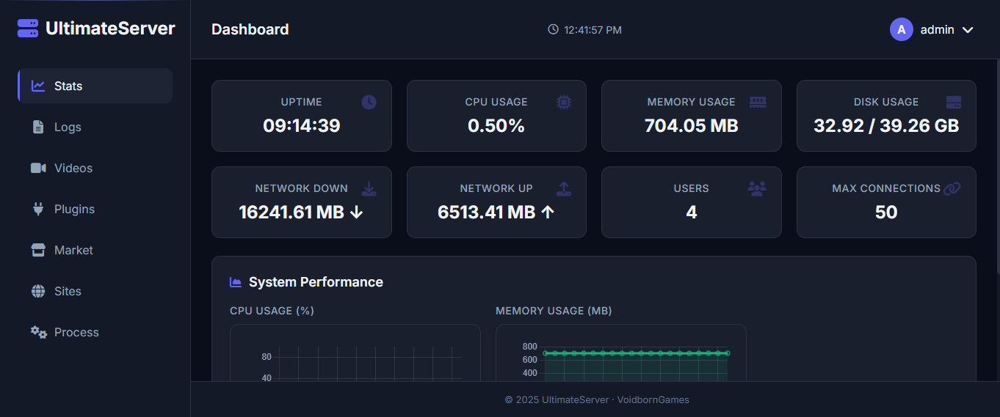

# UltimateServer

 

A powerful, multi-purpose C# server built with a modern, service-oriented architecture. Features real-time dashboard, robust user management, a dynamic plugin system, secure video streaming, Single Click Site Creation, and real-time voice chat capabilities. Designed for game servers, monitoring systems, and real-time applications.



## Quick Links

[**Live Dashboard**](https://dashboard.voidgames.ir) • [**Documentation**](https://github.com/VoidbornGames/UltimateServer/wiki) • [**Getting Started**](https://github.com/VoidbornGames/UltimateServer/wiki) • [**Discord**](https://discord.gg/ftffAd37Hx)

> **Note:** Live dashboard login credentials have been changed due to abuse.

## Table of Contents
- [Features](#features)
- [Requirements](#requirements)
- [Installation](#installation)
- [Configuration](https://github.com/VoidbornGames/UltimateServer/wiki/Configuration)
- [License](#license)
- [Contributing](#contributing)
- [Support](#support)

## Supported Ubuntu OS
| Version | Supported |
|---------|-----------|
| 24.04   | ✅         |
| 22.04   | ✅         |
| < 22.04 | ❌         |

> **Note:** All Debian-based Linux distributions are supported but not officially tested. UltimateServer works on all Linux distros, but the site creation feature might not work on some!

## Features

### 🏗️ Modern Architecture
- **Service-Oriented Design**: Decoupled services for improved maintainability and testability.
- **Dependency Injection**: Clean, modular code with clear separation of concerns.
- **Asynchronous Performance**: Full `async/await` implementation for high concurrency and non-blocking I/O.
- **Event-Driven Communication**: A robust in-memory Event Bus for decoupled, scalable inter-service communication.

### 🔒 Enhanced Security
- **Advanced Password Hashing**: Securely hashes passwords using PBKDF2 with unique salts.
- **Account Lockout Policy**: Automatically locks accounts after multiple failed login attempts.
- **JWT & Refresh Tokens**: Secure, stateless authentication with short-lived access tokens and long-lived refresh tokens.
- **Comprehensive Input Validation**: Protects against injection attacks and malicious data.
- **Strong Password Policies**: Enforces configurable password complexity requirements.

### 🚀 High-Performance Core
- **In-Memory Caching**: Reduces database/file I/O for frequently accessed data.
- **HTTP Response Compression**: Automatically compresses responses to save bandwidth.
- **Connection Pooling Framework**: Efficiently manages and reuses network connections.
- **Graceful Shutdown**: Ensures data is saved and connections close properly on exit.

### 🌐 Web Dashboard
- Modern, responsive dark-themed interface
- Real-time system monitoring (CPU, memory, disk, network)
- Live server logs viewer with color-coded levels
- Video player with streaming support and progress tracking
- Secure user authentication with JWT tokens
- Mobile-friendly design

### 👥 Advanced User Management
- Secure user registration and login system
- Role-based access control (RBAC)
- Session management with "remember me" functionality
- Password reset functionality via email token
- Two-Factor Authentication (2FA) support framework

### 📊 System Monitoring
- Real-time CPU usage tracking
- Memory consumption monitoring
- Disk space usage information
- Network traffic statistics
- Historical performance charts

### 🎬 Video Management
- Upload videos from URLs with progress tracking
- Stream videos directly in the dashboard
- Support for multiple video formats (MP4, WebM, OGG, AVI, MOV, MKV)
- Video library with thumbnail previews
- Secure access control for all video content

### 🎤 Real-Time Voice Chat
- **Low-Latency UDP**: Built on UDP for real-time communication with minimal delay.
- **High-Quality Audio**: Supports clear 16-bit audio at 16kHz for natural-sounding voice.
- **Room & Channel System**: Organize conversations with dedicated rooms and channels.
- **Targeted Communication**: Voice packets are only forwarded to clients in the same room and channel.
- **Multi-Client Support**: Seamlessly connect multiple clients for group conversations.
- **Robust Client Management**: Automatically handles client connections, room joins, and disconnections.
- **Easy-to-Use Client**: A simple C# client library with room/channel commands for quick integration.

### 🔌 Dynamic Plugin System
- **Hot-Reloading**: Load, update, and unload plugins at runtime without restarting the server.
- **Sandboxed Execution**: Plugins run in isolated contexts for security and stability.
- **Async Lifecycle Hooks**: Plugins can hook into server events with `OnLoadAsync`, `OnUpdateAsync`, and `OnUnloadAsync`.
- **Easy Development**: Simple C# interface-based development model for extending server functionality.

### 📝 Logging System
- Automatic log rotation with ZIP compression
- Real-time log viewing in dashboard
- Multiple log levels (Info, Warning, Error, Security)
- Persistent log storage

## Requirements

### System Requirements
- PHP 8.3
- Nginx
- Linux, or Docker-compatible environment

### Network Requirements
- Ports open for connections (default: `11001` for server, `11002` for web dashboard)
- Port open for UDP connections (default: `11003` for voice chat)
- Port open for SFTP connections (default: `11004` for SFTP)

## Installation

### Automated Installation Script
Run the install script:
```bash
bash <(curl -s https://raw.githubusercontent.com/VoidbornGames/UltimateServer/refs/heads/main/%E2%80%8Einstall.sh%E2%80%8E)
```

## License
This project is licensed - see the [LICENSE](https://github.com/VoidbornGames/UltimateServer?tab=License-1-ov-file) file for details.

## Contributing

Contributions are welcome! Please feel free to submit a Pull Request.

1. Fork the project
2. Create your feature branch (`git checkout -b feature/AmazingFeature`)
3. Commit your changes (`git commit -m 'Add some AmazingFeature'`)
4. Push to the branch (`git push origin feature/AmazingFeature`)
5. Open a Pull Request


## Support
If you need help or have questions:

- Check the [Wiki](https://github.com/VoidbornGames/UltimateServer/wiki) for documentation
- Search existing [Issues](https://github.com/VoidbornGames/UltimateServer/issues) for answers
- Create a new issue if you can't find an answer to your question
